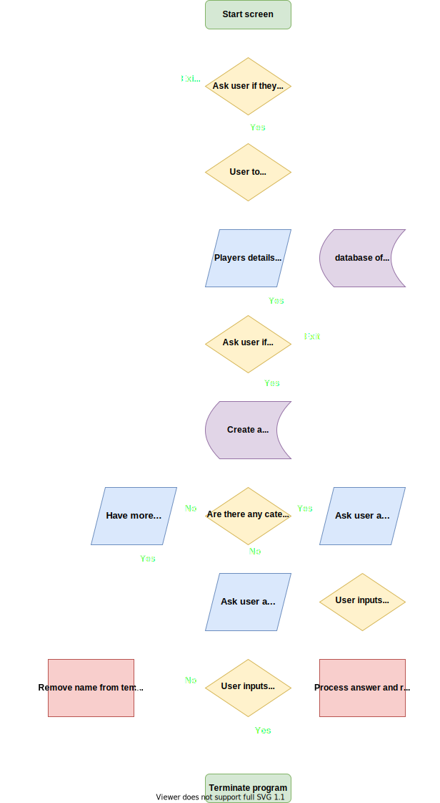

# Statement of Purpose and Scope

**Description -** This application is a “Guess Who” game that interacts with a user. The user will input some information about their facial features that will be saved in the program. The program will then ask a series of questions to the user about their facial feature. As the user answer each of these questions the program will eliminate those that do not match. The list of potential people becomes shorter. The program will narrow down the players who meet all the criteria and eventually pick the correct name.

**Problem that it will solve –** This application provides a user with a to simple game to entertain a them when they have some spare time or bored.

**Target audience –** Its application is intended for anyone that has access to a computer and is looking for some entertainment. the application also tries to avoid any discrimination no matter of the user’s gender or race.

**How will it be used –** This will be used on the user’s personal computer. Once the program has been opened it will bring the user to the start of the game and ask if the user would like to continue. It will then ask the user to input their name and details. Once that is completed it will ask if the user is ready to play. If so the game with begin to ask a series of question for the user to answer. These questions will start to narrow down who the player could potentially be. Once the program has guessed the correct name of the user, it will ask if they would like to play again or not.

## Features

A feature that takes in the new users’ details.

1. It will ask if the player wats to play, if so, it will continue to take user details, if not will take user back to the start screen

2. It will need to ask the player for full name. It will need to check if the play has entered in a full name or only their first. If the user has only entered in their first name if will ask them again to enter their full name.

3. It will ask for the colour hair they have and ensure that they have enter a colour that is already in the database. If not, it will ask if what is the closest colour to what is in the data base.

4. It will ask for their eye colour and ensure that they have enter a colour that is already in the database. If not, it will ask if what is the closest colour to what is in the data base.

5. It will ask for their gender and ensure that they have enter gender that is already in the database. If not, it will ask what the closest gender to what is in the data base.

6. It will ask a series of question with only yes of no answers such as if they wear glasses, are they bald do they have facial hair. If the answer given is neither yes or no, it will ask to be answered by entering yes or no.

7. It will then add all the users’ data to the player database.

8. If an error is to occur, the function will notify the user and return to the start of the programme.

Creating a Feature that create a temporary lists and dictionaries of each category.
	 
1. To eliminate players as the questions are being asked, a temporary list of the player within the databank will need to be created. This will include the new users’ details.

2. It is to make a range of temporary dictionaries of the feature of the player in the data bank. This is to include:

	1. A temporary dictionary of hair colour

	2. A temporary dictionary of eye colour

	3. A temporary dictionary of if they are bald.

	4. A temporary dictionary of if they wear glasses.

	5. A temporary dictionary of the players facial hair.

3. If an error is to occur, the function will notify the user and return to the start of the programme.

Create a feature that will generate questions for the user to answer.

1. It will need to be able display to the user how the game is played followed by asking if the user is ready.  This function needs to be able to handle faults if an incorrect input has been entered.

2. If the user answers yes then start the game. If exit, take player back to the start.

3. This will need a function to generate a random question using data from the temporary dictionaries.

4. The questions that are asked can only be answers as yes or no answers.  This function will be able to handle faults if an incorrect input has been entered.

5. Depending on the user’s input, it will filter through the names who match the criteria.

6. A counter is to be implements to count how many questions it has asked.

7. After three questions another function picks a name randomly and asks the user, depending on the answer the program will either keep asking questions until the there’s no more questions up or completes the game.

8. Once the correct name has been generated the user will have the option to either play again or exit back to the start.

Create A Bash script argument that allows the users to see additional information.

1. An additional argument can be given if the bash script if the user wishes to see additional information.

2. The program will call for the argument. If the values if correct it will display the information.

3. If no argument is given, then the program will continue as normal.

# User Interaction and Experience.

### Find how to interact with each feature.

The program should be quite easy to follow as it will prompt the user through the terminal window what they need to do. The user will also be able to refer to the Help.txt file that comes with the program. Within that document will be the information on how the game is played.

### User interaction with each feature.

The user will interact will each feature through the terminal window. As the program moves through each feature it will ask the user for an input. If the user input wasn’t what the program was expecting, it will prompt the user with options of what the input needs to be before moving on.

### How errors will be handled by the application and displayed to the user.

If the program comes into an error as the game is played the user will be notified through a prompt on the terminal window. The program will either continue with the game or take the user back to the start of the game.

# Control Flow Diagram

# Implementation Plan
| Implementation of different features | Priority  | Duration  | Deadline | Comments |
|---|---|---|---|---|
| A start game feature | Medium  | 5 hours  | 15/07/2021 | This can be completed after the Add New User function and the Main Game Function  |
| - Create a feature to ask the player if they want play |  |  |  |  |
| - Asks if they're a new player  |  |  |  |  |
| - Opens either "add a new play function" or "start playing function"  |  |  |  |  |
|  |  |  |  |  |
| An "Add new player" feature | Medium  | 7 hours  | 15/07/2021 | To be done after main game and list feature. If unable to get this completed due to deadline app can still partially work.  |
| -Ask for users full  names and store is a list titled "Names"  |  |  |  |  |
| -Ask for users questions about facial features and save in appropriate dictionaries |  |  |  |  |
| -needs to make sure numbers aren’t entered |  |  |  |  |
| - A default list of 200 names and facial features need to be generated |  |  |  |  |
|  |  |  |  |  |
| List feature | High  | 10 hours  | 12/07/2021 | This will be needed to be completed prior to starting the  main game feature.  |
| -Create a list for names of all the player and fictional character. |  |  |  |  |
| - Create a temporary list of all previous and new the player names.  |  |  |  |  |
| - Creates a list of descriptive words used within each facial features dictionary |  |  |  |  |
| - Need to ensure that the  descriptive words aren't repeated within their lists  |  |  |  |  |
| - A default list of 20 names and facial features need to generated needed  |  |  |  |  |
|  |  |  |  |  |
| Main game feature  | High  | 12 hours | 14/07/2021 | Plenty of time needs to be allocated for this.  |
| -Communicate to the user the rules of the game |  |  |  |  |
| - It will need to be able to generate questions with a random feature   |  |  |  |  |
| - it will need to take in user responses and ensure no errors occuring |  |  |  |  |
| - needs remove the feature it has asked in order not to ask it again |  |  |  |  |
| - names to be filtered depending on the response of the user. |  |  |  |  |
| - Has a counter to figure out how many questions have been asked.  |  |  |  |  |
|  |  |  |  |  |
| Have the terminal cleared after each question  | low  |  | 16/07/2021 | This is a nice to have and is to be completed once all other work has been done  |
| A help file needs to be created for the users  | Medium  |  | 16/07/2021 |  |
| - |  |  |  |  |
| Bash script  | Medium  | 3 hours  | 16/07/2021 | This is to be done once Python script is complete |
| -need to implement an argument from the bash script that allow user to see additional information  |  |  |  |  |

# Development log
 
## Status update 13/07/2021:

The fundamentals of the main functions including New User input, Random question generator, Answer filter and User data base mostly complete.

The User data base is now located in a separate file to help clean up the code. This is now accessible to the other functions.

The New User function is now able to take inputs from the user and verify that it is a correct answer before continuing onto the next question. As the user completes the questions, its associated list/dictionary is appended with the input. Also, a single function has been made to process all New User inputs. As each question is asked, it calls this function and give it the necessary variables to check the answer and update their list or dictionaries.

The random question generator is mostly complete. It can create random questions base on the information within a temporary data base. Within this temporary data base has a list of dictionaries of the players’ names and their features such as hair colour. As each question is asked, it removes either the single feature or the whole features dictionary depending on the users answer. This I to ensure that the same question does not get asked twice.

A fault was found during early testing. If the question generator run out of possible questions the program would go into an error. A ‘try/except’ statement has been put in to allow the function to continue. The Question Generator feature has taken a considerable amount of time to complete and has meant a review on the ongoing works schedule to be adjusted.

The answer filter is still in progress. I still need to think of the best way for this to function, whether it will be in its own function or be incorporated into the question generator function.

As for ongoing work that needs to be completed, once all features are working independently, I will need to work on how they will flow throughout the program. Followed by testing for faults and errors.

## Status update 16/07/2021:
All functions are now working in sync and functioning correctly.

The program now has a start page that displays a logo and ask if the user would like to continue.

As the user moves on it will asks the user to input their information and ask if they would like to continue with the game, enter a new player or exit. If the user chooses to add a new player if will restart the user input loop. If the user wants to exit it will go back to the start page. When the user proceeds from the main the game will start.

I have also made the screen clear after each question. This was to make it more visually appealing to the user.

For the program to fail successfully there have been multiple Try and Except functions put in throughout the code.

A bash script has also been developed to allow the user to start up the program.

An additional feature has been included into the program that allow the user to see more information during the game. This feature utilizes an argument inputted from the bash script. When the user starts the program with the argument "inspect" it will display the inputted data from the user and see the list of possible names that meet the criteria while the questions are being asked.

This led to a test scenario to see what would happen if the bash script was started without an argument. This presented a flaw within the program and cause the program to crash. an additional Try/Except function was put in to overcome this issue and allow the game to be played.

The code size has grown considerably as the program has progressed. While the code does work correctly, I believe there are some adjustment that could be made to reduce the size of the code. But as the code still preforms as intended, this will only be attempted once all documentation is completed.